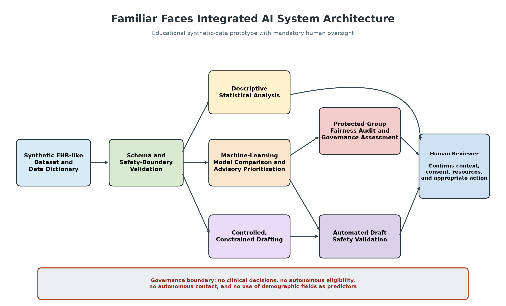

# Familiar Faces: Integrative Industry Synthesis

## Project Overview

Familiar Faces is a human-supervised AI prototype exploring how community paramedicine programs might prioritize and plan outreach for frequent users of emergency medical services.

The project integrates synthetic EHR-like data, statistical analysis, machine-learning comparison, fairness auditing, controlled nonclinical drafting, and mandatory human review.

This is an educational synthetic-data prototype. It is not approved for clinical use, operational deployment, eligibility decisions, or autonomous patient contact.

## System Architecture



The workflow includes synthetic-data validation, descriptive analysis, advisory machine-learning prioritization, fairness-governance assessment, controlled drafting, automated safety validation, and human review.

All outputs are decision-support materials. They do not authorize or initiate real-world actions.

## Data

The project uses 3,000 entirely synthetic patient records. No protected health information or real patient data is included.

Age group, sex, and race/ethnicity are retained only for post-model fairness auditing. They are excluded from model predictors and generated case materials.

## Project Structure

The primary project files are:

- `data/familiar_faces_synthetic.csv` — synthetic patient records
- `data/data_dictionary.csv` — field definitions
- `familiar_faces_system.py` — integrated analytical pipeline
- `integrative_industry_synthesis.ipynb` — source notebook
- `integrative_industry_synthesis_executed.ipynb` — executed notebook
- `figures/` — architecture and analytical figures
- `results/` — statistical, model, fairness, and drafting outputs

## Environment Setup

The project was developed using Python in a virtual environment.

From PowerShell:

```powershell
python -m venv .venv
.\.venv\Scripts\Activate.ps1
python -m pip install --upgrade pip
python -m pip install -r requirements.txt
```

## Reproducing the Analysis

Run the complete integrated pipeline:

```powershell
python familiar_faces_system.py
```

A successful run ends with:

```text
End-to-end pipeline: PASSED
Deployment status: EDUCATIONAL SYNTHETIC-DATA PROTOTYPE
Human review required: True
```

## Statistical Analysis

The statistical component summarizes EMS utilization, emergency-department visits, social-support needs, primary-care connection, and simulated outreach-response rates.

These results describe relationships within synthetic data. They do not establish causation or represent clinical outcomes.

## Machine Learning

The project compares logistic regression and random forest classifiers using the same stratified training and test sets.

Logistic regression was selected with a test ROC AUC of 0.685 and average precision of 0.579. This moderate performance supports use only as a human-reviewed advisory prioritization signal—not as an autonomous decision system.

## Fairness Governance

Protected demographic attributes are excluded from model training and retained only for post-model auditing.

The audit compares human-review flag rates, true-positive rates, and false-positive rates. Groups with fewer than 25 test records are excluded from disparity calculations.

The prototype produced an overall status of REVIEW_REQUIRED, with seven comparisons requiring review and two small groups excluded. The 0.10 monitoring threshold is not a legal definition of fairness or deployment approval.

## Controlled Drafting

The system creates 12 deterministic, constrained case summaries and nonclinical outreach-plan drafts for selected synthetic records.

Drafts exclude demographic information, avoid diagnosis and treatment advice, prohibit autonomous eligibility decisions and patient contact, and require human review. Automated safety validation passed for all 12 drafts.

This component applies safeguards informed by generative-AI development but does not perform live large-language-model inference.

## Safety Boundaries

The prototype requires:

- Synthetic data only
- No protected demographics as model predictors
- No demographic information in generated materials
- No clinical diagnosis or treatment recommendations
- No autonomous eligibility decisions
- No autonomous patient contact
- Human approval before any action
- Fairness review when monitoring thresholds are exceeded

## Limitations

- All records and outcomes are synthetic.
- The modeled outcome is simulated outreach response, not clinical benefit.
- Predictive performance is moderate.
- Subgroup differences require contextual investigation.
- Some demographic groups have small test samples.
- Feature importance does not establish causality.
- The drafting component is deterministic rather than live LLM inference.
- The system has not undergone clinical, legal, privacy, security, accessibility, or deployment validation.

## Real-World Requirements

Before any real-world pilot, the organization would require:

- Formal HIPAA, privacy, and legal review
- Authorized data-governance procedures
- Cybersecurity controls and audit logging
- Stakeholder and community participation
- Consent and outreach policies
- Independent model validation
- Human-review and escalation procedures
- Ongoing bias and fairness monitoring
- Workflow and usability testing
- Defined accountability and incident-response processes

## Responsible-Use Statement

Familiar Faces demonstrates how analytical and AI methods can be integrated into a governed community-paramedicine concept. It must not be interpreted as a deployable clinical system or used to make decisions about real people.
